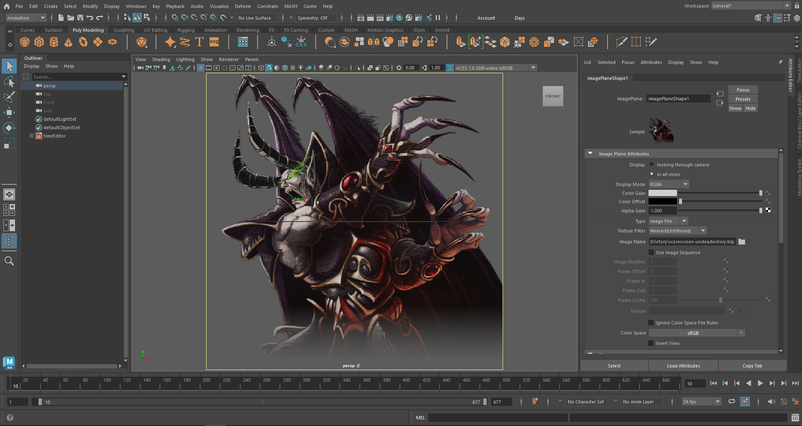
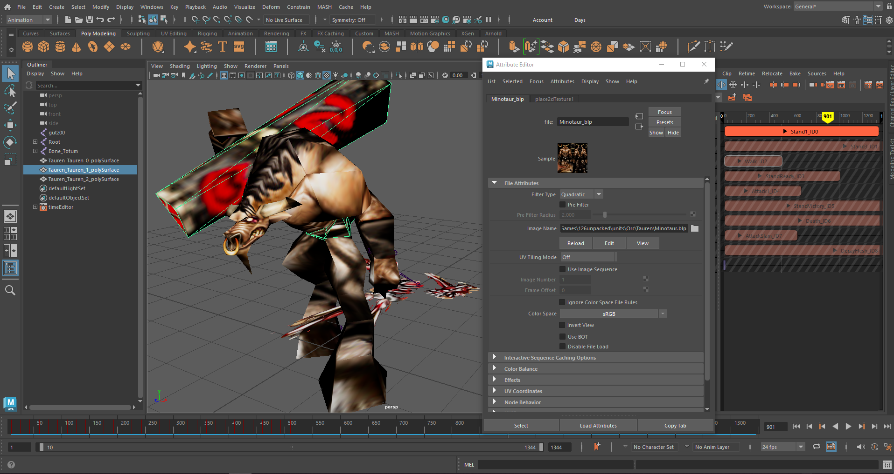
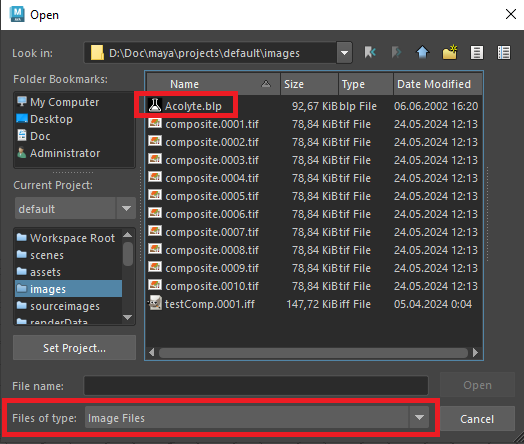

# Maya WarTex (BLP Image Loader)

This is a small Autodesk Maya plugin written using the .NET API.
It adds support for loading BLP (a legacy texture format used by Warcraft III and World of Warcraft) image files via `MPxImageFile`, allowing them to be opened as regular image files inside Maya.

    
    

There's no direct GPU loading (the `glLoad()` method) here, only the `MImage` instance is initialized. Mipmaps are ignored.

## Dirty MEL hack
The project also demonstrates how image file extensions can be registered in Maya’s Image Types list at runtime using MEL from managed code.

Maya does not provide a public API for this in `MPxImageFile`, so a MEL-based workaround is required.

## Target DCC
Made for `.NET 8` compatible versions of Maya (Maya 2025 or later), Windows only.

For Maya 2024 and earlier, plugin requires a BLP reader library compatible with `.NET Framework 4.8`.
The image format integration code remains relevant for these versions, but adjustments to syntax may be necessary.

## Installation
1. Download a build for your version of Maya from the [releases](https://github.com/wiselencave/maya-wartex/releases) page, or build it yourself using the [dependencies](#dependencies). 
2. Copy all `dll` files to `...\Maya202x\bin\plug-ins`.
3. Start Maya and load the plug-in using the MEL command `loadPlugin -qt wartex.nll.dll`, or open the `Windows -> Plug-in Manager` menu, find `wartex.nll.dll`, and check both `Loaded` and `Auto load`.

## Dependencies 
- [War3Net.Drawing.Blp](https://github.com/Drake53/War3Net/tree/master/src/War3Net.Drawing.Blp) by Drake53. Used as a NuGet package for reading and decoding BLP textures.
- `openmayacs.dll`. Maya .NET API assembly provided with Autodesk Maya.